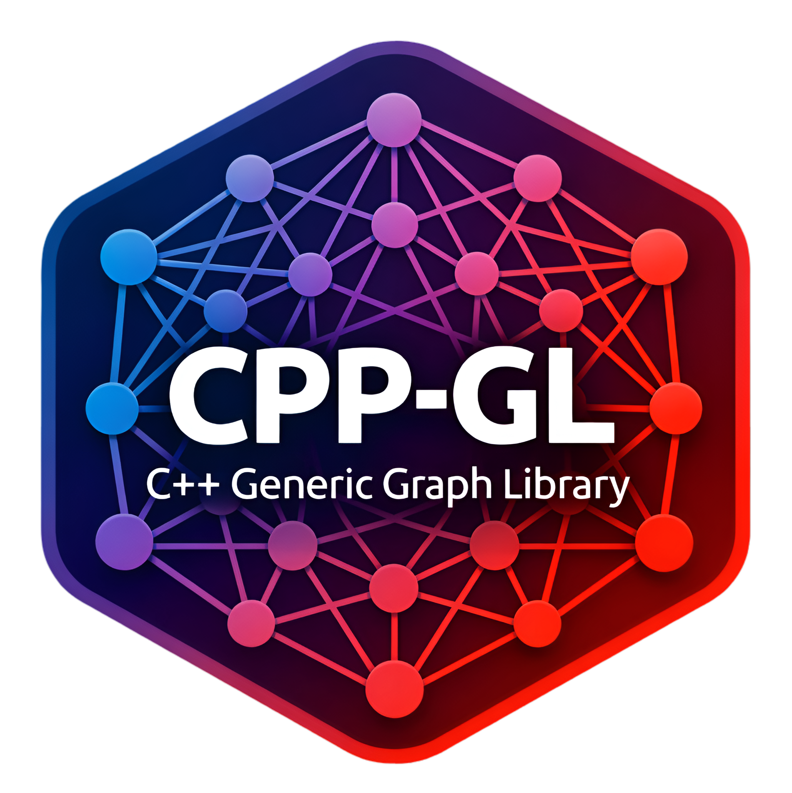

<style>
  .md-typeset h1 { display: none !important; }
</style>

<div align="center" markdown="1">
  
</div>

<br />

<div align="center" markdown="1">

[](https://github.com/SpectraL519/cpp-gl/actions/workflows/g++)
[](https://github.com/SpectraL519/cpp-gl/actions/workflows/clang++)
[](https://github.com/SpectraL519/cpp-gl/actions/workflows/format)
[](https://github.com/SpectraL519/cpp-gl/actions/workflows/benchmarks.yaml)

</div>

<br />

## Overview

CPP-GL is a highly customizable, intuitive, and concept-driven graph and hypergraph library designed for modern C++ standards.

Designed strictly around modern C++ paradigms, the library heavily leverages templates and concepts to deliver an API that is exceptionally fast, generic, and type-safe. It relies solely on the C++ standard library, meaning it requires no external dependencies and integrates perfectly with modern C++ tools such as range-based loops, the `<ranges>` library, standard algorithms, stream operations and more.

---

## Module Architecture: GL vs. HGL

To accommodate different mathematical models without compromising API clarity or performance, the library is strictly partitioned into two primary modules:

- **GL (Graph Library):** The core module dedicated to standard graphs. It handles both directed and undirected topologies where edges represent connections between two vertices. It provides a comprehensive suite of utilities including structural generators, graph modifiers, and a broad spectrum of classical graph algorithms.
- **HGL (Hypergraph Library):** A specialized module dedicated to hypergraphs, where a single hyperedge represent higher-order connections. It features generalized traversal algorithms and incidence-based memory models tailored for complex, multi-way relationships.

## GL: Core Features

- **Unified API:** The `gl::graph` class offers a single, consistent interface that completely abstracts away the underlying data structures. Users can seamlessly swap between different backend representations without needing to rewrite any of their traversal logic, property accesses, or algorithm calls.
- **Flexible Memory Layouts:** The library provides a comprehensive suite of memory-efficient representations tailored to different graph types and access patterns. Users can choose between standard container-based layouts (Adjacency Lists and Matrices) and highly optimized, cache-friendly contiguous array structures (Flat Lists and Flat Matrices).
- **Customizable Element Properties:** Vertices and edges can carry arbitrary, user-defined payloads. Whether you are assigning standard metric weights and colors or attaching complex, application-specific data structures, the library's traits system ensures that property injection and access remain strictly type-safe and performant.
- **Zero-Cost Abstractions:** By relying on C++20 concepts instead of virtual interfaces and dynamic dispatch, CPP-GL eliminates vtable overhead while enforcing strict compile-time contracts.
- **Extensible Engines & Concrete Algorithms:** CPP-GL features a dual-layered algorithmic architecture. At its core, it provides highly generic search templates (such as BFS, DFS and Priority-First Search) that act as foundational engines, allowing users to build entirely new algorithms by injecting custom callbacks. Built upon these engines is a robust suite of concrete, ready-to-use algorithms for immediate application.
- **Robust I/O Facilities:** Built-in serialization and formatting tools allow for seamless translation of in-memory graphs to and from standard streams and files, utilizing a shared global state for consistent formatting.

---

## Installation & Integration

CPP-GL is a header-only template library. You can integrate it into your project either by directly including the headers or via CMake.

### Option A: CMake `FetchContent` (Recommended)

The easiest way to integrate CPP-GL is to fetch it directly from the GitHub repository during your CMake configuration phase:

```cmake
cmake_minimum_required(VERSION 3.14)
project(my_project LANGUAGES CXX)

include(FetchContent)

FetchContent_Declare(
    cpp-gl
    GIT_REPOSITORY [https://github.com/SpectraL519/cpp-gl.git](https://github.com/SpectraL519/cpp-gl.git)
    GIT_TAG <tag> # Spcify the desired version tag, branch, or specific commit
)

FetchContent_MakeAvailable(cpp-gl)

add_executable(my_project main.cpp)

set_target_properties(my_project PROPERTIES
    CXX_STANDARD 23 # (1)!
    CXX_STANDARD_REQUIRED YES
)

target_link_libraries(my_project PRIVATE cpp-gl)
```

1. The CPP-GL library requires C++23

### Option B: CMake `find_package`

If you have already downloaded or installed the library locally, you can add the <cpp-gl-root>/include path to your system and link it using `find_package`:

```cmake
find_package(cpp-gl REQUIRED)
target_link_libraries(my_project PRIVATE cpp-gl::cpp-gl)
```

### Option C: Including the Headers Directly

If you do not wish to use CMake, you can simply download the desired version of the library from the [Releases Page](https://github.com/SpectraL519/cpp-gl/releases) and add the `include` directory of the library to your project via the `-I<cpp-gl-dir>/include` flag.

---

## Next Steps

Ready to write some code? Choose a module below to view its Quick Start guide and dive into the tutorials:

* [**Get Started with GL (Standard Graphs)**](gl/quick_start.md) - Master the core concepts, build custom topologies, and explore the robust suite of generic traversal engines and classical algorithms.
* **Get Started with HGL (Hypergraphs)** - *(Coming Soon)*
